# Conf.io

## 프로젝트 소개

정해진 시간 내에 발표가 이뤄지는 컨퍼런스의 특성상 발표 이후 질문의 개수는 다소 제한적입니다. 더군다나 참여자의 지식 수준은 천차만별이기에 질문은 더욱 조심스러워집니다. 이러한 점 때문에 (많은 경우에) 궁금한 것이 있지만 이런 질문을 해도 되나 싶은 질문을 차마 말하지 못한 채 발표가 끝났던 경험이 있으리라 생각합니다. 그래서 우리는 conf.io라는 프로젝트를 통해 발표자와 참여자, 그리고 참여자와 참여자 간의 소통을 원활하게 하여 이러한 문제를 해결해보고자 합니다.

## 기술 & 개발환경

언어 :(서버) Javascript, mySQL, mongoDB, socekt.io, node.js

## 핵심기능

- 발표자의 PPT 슬라이드 보기 및 참조링크 보여주기 기능
- 컨퍼런스 참여자간의 채팅 기능
- 질문 태그를 이용한 질문 기능 및 질문에 대한 답변 기능

## 서비스 특징

- 컨퍼런스 주최자는 컨퍼런스 정보(제목, 날짜, 설명 등)와 해당 컨퍼런스 운영자 계정을 지정할 수 있다.
- 컨퍼런스와 회원(현 서비스)의 관계는 주최자, 운영자, 발표자, 참가자로 나뉜다.
- 관계에 따라 접근 권한이 다르고, 참가자는 컨퍼런스 정보를 조회, 컨퍼런스 세션별 대화에 할 수 있고, 컨퍼런스의 관련 질문과 답글을 할 수 있다.
- 회원은 자기가 참여했던 컨퍼런스의 리스트를 마이페이지에서 볼 수 있으며 컨퍼런스가 끝난 이후에도 정보를 조회를 할 수 있다.

## Database 구조

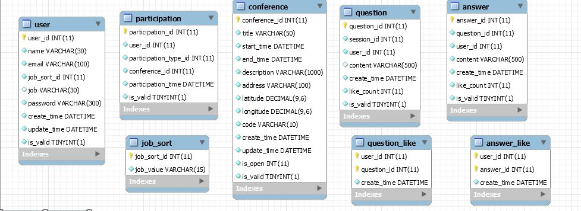

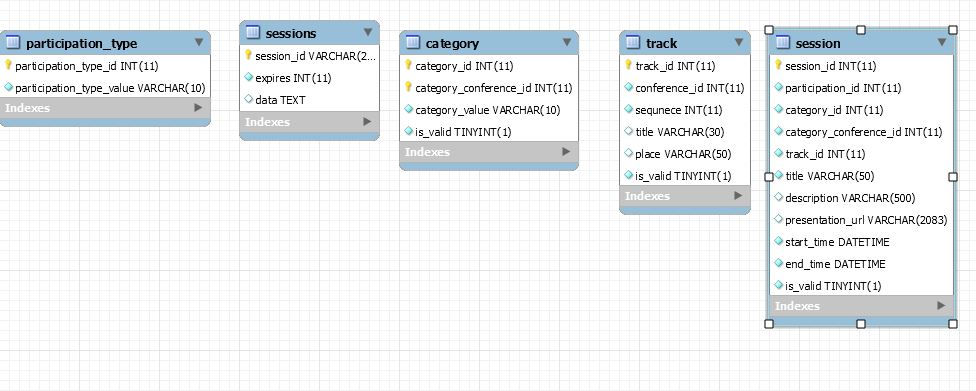

- 회원 정보는 user에서 관리한다.
- 컨퍼런스의 정보는 conference, session, track에서 관리한다.
- conference는 N개의 track을 가질 수 있고, track은 N개의  session을 가질 수 있다.
- session는 user와 participation의 관계가 형성이 되고 관계는 주최자, 관리자, (세션)발표자, 참여자로 구분 된다.

## 라이센스

- NPM 모듈 : MIT License
- mongoDB : GNU AGPL v3.0
- 

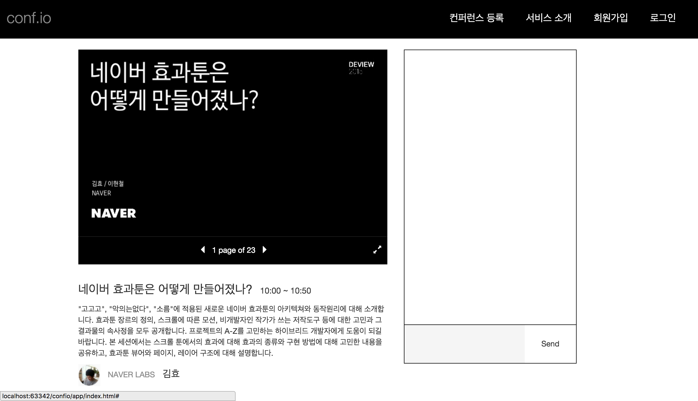
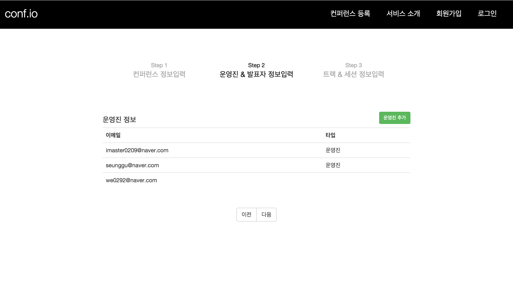
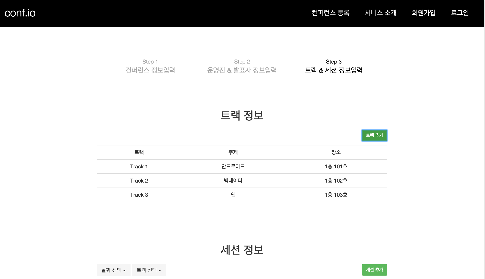
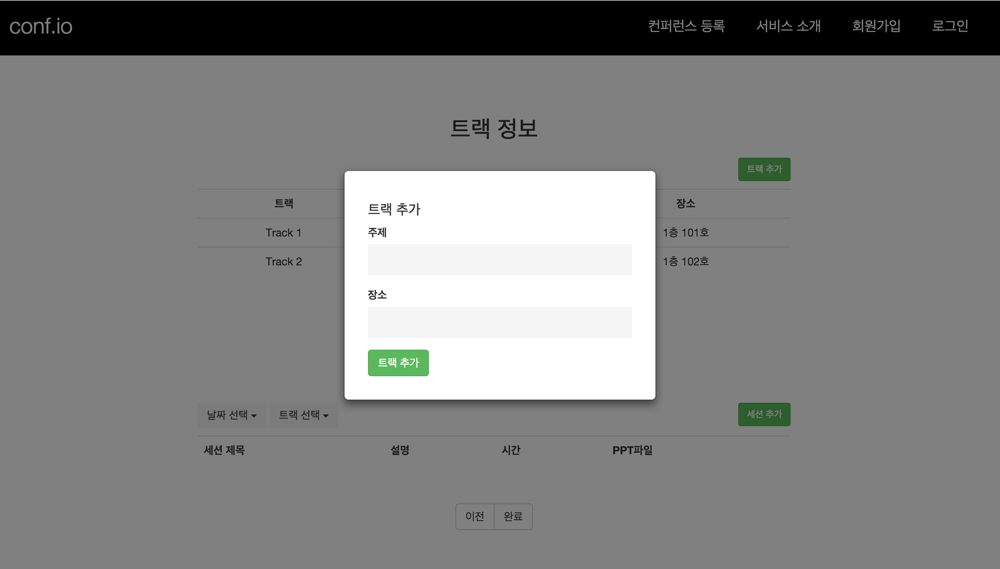
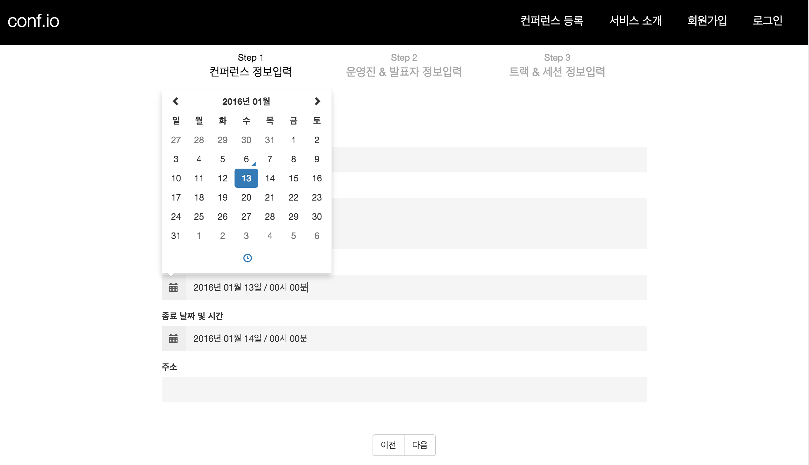
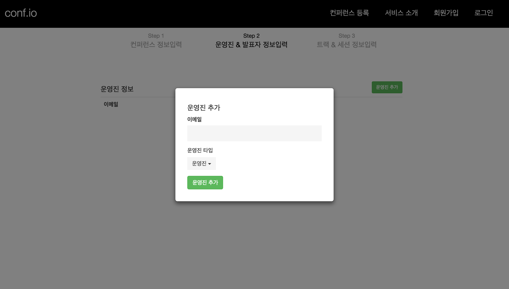
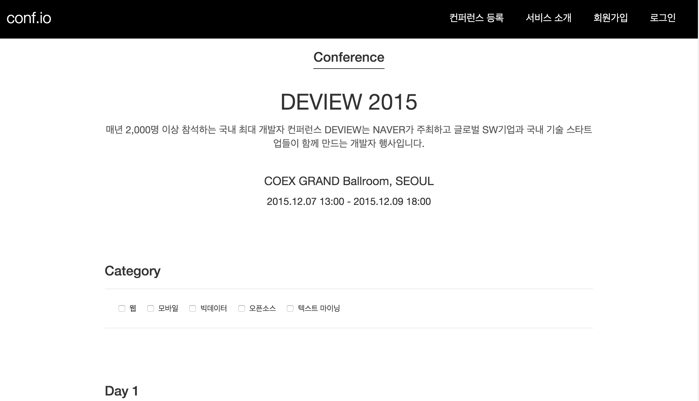
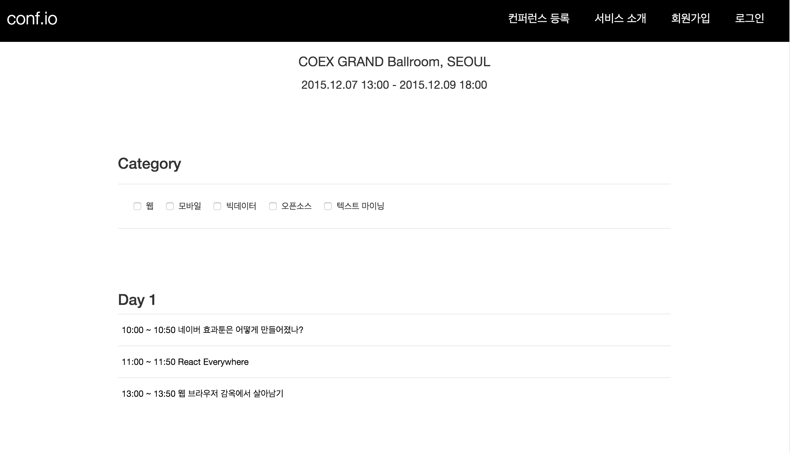
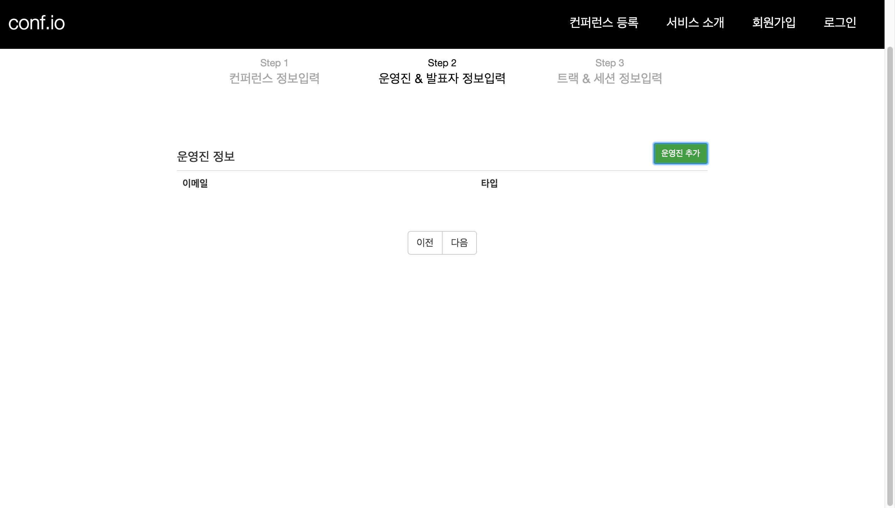
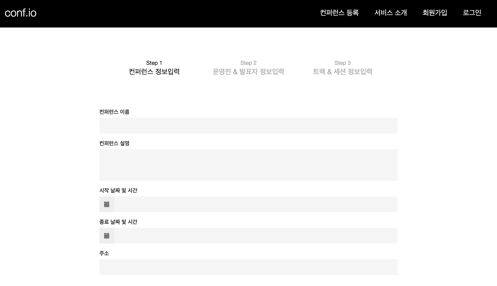

